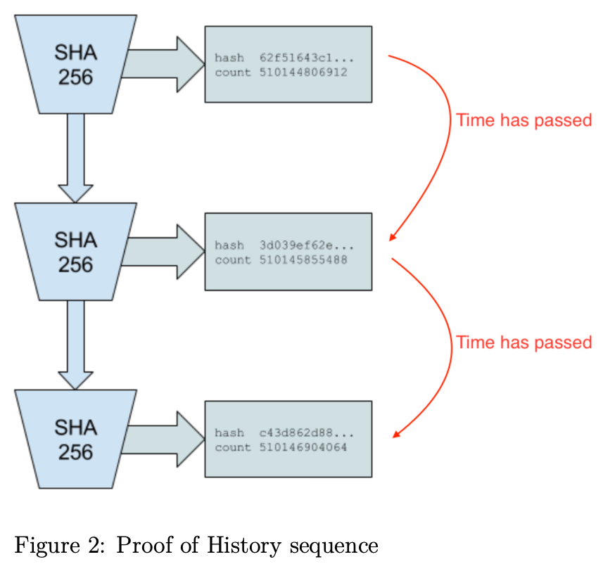

# Solana White Paper Summary

**Original Title:**
Solana: A new architecture for a high performance blockchain v0.8.14

Author:
Anatoly Yakovenko

**I (Robinson) have studied the original Solana White Paper version 0.8.14 (which was published on GitHub on October 18, 2018 in the solana-labs/whitepaper repository) and have taken notes here to come back to and work on later, feel free to have a read...**

## Table of Contents
[Abstract](#abstract)
1. [Introduction](#introduction)
2. [Outline](#outline)
3. [Network Design](#network-design)
4. [Proof of History](#proof-of-history)
  4.1 [Description](#description)
  4.2 [Timestamp for Events](#timestamp-for-events)
  4.3 [Verification](#verification)

## Abstract

This paper proposes a new blockchain architecture based on Proof of History (PoH) - a prroof for verifying order and passage of time between events. PoH is used to encode trustless passage of time into a ledger - an append only data structure (Append only means new data can only be added to the end of the blockchain, existing data can't be modified, deleted or reordered... This ensures immutability as once semething is added, it stays this way permanent). When used alongside a consensus algorithm such as Proof of Work (PoW) or Proof of Stake (PoS), PoH can reduce messaging overhead in a Byzantine Fault Tolerant replicated state machine, resulting in sub-second finality times.  
This paper also proposes two algorithms that leverage the time keeping properties of the PoH ledger - a PoS algorithm that can recover from partitions of any size an efficient streaming Proof of Replication (PoRep). **The combination of PoRep and PoH provides a defense against forgery of the ledger with respect to time (ordering) and storage.** The protocol is analyzed on a 1 gbps network, and this paper shows that throughput up to 710K transactions per second (TPS) is possible with today's hardware.

## 1. Introduction

Blockchain is an implementation of a fault tolerant replicated state machine (a distributed computing model where multiple identical copies of a system process the same sequence of inputs to maintain consistent states across all instances, while being designed to continue operating correctly even if some replicas fail or behave maliciously).  
Current publicly available blockchains do not rely on time, or make a weak assumption about the participant's abilities to keep time. Each node in the network usually relies on their own local clock without knowledge of any other participants clocks in the network. The lack of a trusted source of time means that when a message timestamp is used to accept or reject a message, there is no guarantee that every other participant in the network will make the exact same choice. The PoH presented here is designed to create a ledger with verifiable passage of time, i.e. duration between events and message ordering. It is anticipated that every node in the network will be able to rely on the recorded passage of time in the ledger without trust.

## 2. Outline

Description about how this paper is organized...

## 3. Network Design

As shown in **Figure 1**, at any given time a system node is designated as Leader to generate a Proof of History sequence, providing the network global read consistency and a verifiable passage of time. The Leader sequences user messages and orders them such that they can be efficiently processed by other nodes in the system, **maximizing throughput**. It executes the transactions on the current state that is stored in RAM and publishes the transactions and a signature of the final state to the replications nodes called **Verifiers**. Verifiers execute the same transactions on their copies of the state, and publish their computed signatures of the state as confirmations. The published confirmations serve as votes for the consensus algorithm.

In a non-partitioned state, at any given time, there is one Leader in the network. Each Verifier node has the same hardware capabilities as a Leader and can be elected as a Leader, this is done through PoS based elections.

## 4. Proof of History

**Proof of History is a sequence of computation that can provide a way to cryptographically verify passage of time between two events**. It uses a cryptographically secure function written so that output cannot be predicted from the input, and must be completely executed to generate the output. The function is run in a sequence on a single core,** its previous output as the current input**, periodically recording the current output, and how many times its been called. The output can then be re-computed and verified by external computers in parallel by checking each sequence segment on a separate core.  
Data can be timestamped into this sequence by appending the data (or a hash of some data) into the state of the function. The recording of the state, index and data as it was appended into the sequences provides a timestamp that can guarantee that the data was created sometime before the next hash was generated in the sequence. This design also supports horizontal scaling as multiple generators can synchronize among each other by mixing their state into each others' sequences.

  ## 4.1 Description

The system is designed to work as follows. With a cryptographic hash function, whose output cannot be predicted without running the function (e.g. sha256, ripemd,...), run the function from some random starting value and take its output and pass it as the input into the same function again. Record the number of times the function has been called and the output at each call. **The starting random value chosen could be any string, like the headline of the New York times for the day**.  

For example:
#### PoH Sequence
| Index | Operation                              | Output Hash |
|-------|----------------------------------------|-------------|
| 1     | sha256("any random starting value")    | hash1       |
| 2     | sha256(hash1)                          | hash2       |
| 3     | sha256(hash2)                          | hash3       |

(Where hashN represents the actual hash output. It is only necessary to publish a subset of the hashes and indices **at an interval**.)

For example:
#### PoH Sequence
| Index | Operation                              | Output Hash |
|-------|----------------------------------------|-------------|
| 1     | sha256("any random starting value")    | hash1       |
| 200   | sha256(hash199)                        | hash200     |
| 300   | sha256(hash299)                        | hash300     |

As long as the hash function chosen is collision resistant, this set of hashes can only be computed in sequence by a single computer thread. This follows from the fact that there is no way to predict what the hash value at index 300 is going to be without actually running the algorith from the starting value 300 times. It can be inferred from the data structure **that real time has passed between index 0 and index 300**.  

  ## 4.2 Timestamp for Events  

In the example in Figure 2, hash 62f51643c1 was produced on count 510144806912 and hash c43d862d88 was produced on count 510146904064. This proves that we can
trust that real time passed between count **510144806912** and count **510146904064**.  

This sequence of hashes can also be used to record that some piece of data was created before a particular hash index was generated. Using a 'combine' function to combine the piece of data with the current hash at the current index. The data can simlpy be a cryptographically unique hash of arbitrary event data.  
The combine function can be a simple append of data, or any operation that is collision resistant. The next generated hash represents a timestamp of the data, because it could have only been generated after that specific piece of data was inserted.

Some external event occurs, like a photograph was taken, or any arbitrary digital data was created:

#### PoH Sequence With Data
| Index | Operation                                  | Output Hash |
|-------|--------------------------------------------|-------------|
| 1     | sha256("any random starting value")        | hash1       |
| 200   | sha256(hash199)                            | hash200     |
| 300   | sha256(hash299)                            | hash300     |
| 336   | sha256(append(hash335, photograph_sha256)) | hash336     |

Hash336 is computed from the appended binary data of hash335 and the sha256 of the photograph. The index and the sha256 of the photograph are recorded as part of the sequence output. So anyone verifying this sequence can then recreate this change to the sequence.

#### PoH Sequence With 2 Events
| Index | Operation                                   | Output Hash |
|-------|---------------------------------------------|-------------|
| 1     | sha256("any random starting value")         | hash1       |
| 200   | sha256(hash199)                             | hash200     |
| 300   | sha256(hash299)                             | hash300     |
| 336   | sha256(append(hash335, photograph1_sha256)) | hash336     |
| 400   | sha256(hash399)                             | hash400     |
| 500   | sha256(hash499)                             | hash500     |
| 600   | sha256(append(hash599, photograph2_sha256)) | hash600     |
| 700   | sha256(hash699)                             | hash700     |

Because the initial process is still sequential, we can then tell that things entered into the sequence must have occurred sometime before the future hashed value was computed. Photograph2 was created before hash600 and photograph1 was created before hash336. Inserting the data into the sequence of hashes results in a change to all subsequent values in the sequence. As long as the hash function used is collision resistant, and the data was appended, it should be computationally impossible to pre-compute any future sequences based on prior knowledge of what data will be integrated into the sequence.  
The data that is mixed into the sequence can be the raw data itself, or just a hash of the data with accompanying metadata. 

In the example in Figure 3, input cfd40df8… was inserted into the Proof of History sequence. The count at which it was inserted is 510145855488 and the state at which it was inserted is 3d039eef3. All the future generated hashes are modified by this change to the sequence, this change is indicated by the color change in the figure. **Every node observing this sequence can determine the order at which all events have been inserted and estimate the real time between the insertions**.

  ## 4.3 Verification

The sequence can be verified correct by a multicore computer in significantly less time than it took to generate it.

For example:
#### Core 1
| Index | Data                                   | Output Hash |
|-------|----------------------------------------|-------------|
| 200   | sha256(hash199)                        | hash200     |
| 300   | sha256(hash299)                        | hash300     |
#### Core 2
| Index | Data                                   | Output Hash |
|-------|----------------------------------------|-------------|
| 300   | sha256(hash299)                        | hash300     |
| 400   | sha256(hash399)                        | hash400     |

The expected time to verify that the sequence is correct is going to be:  

$$\frac{\text{Total number of hashes}}{\text{Hashes per second per core} \times \text{Number of cores available to verify}}$$  

In the example in Figure 4, each core is able to verify each slice of the sequence in parallel. Since all input strings are recorded into the output, with the counter and state that they are appended to, the verifiers can replicate each slice in parallel. The red colored hashes indicate that the sequence was modified by a data insertion.

  ## 4.4 Horizontal Scaling

It's possible to synchronize multiple Proof of History generators by mixing the sequence state from each generator to each other generator, and thus achieve horizontal scaling of the PoH generator. **This scaling is done without sharding.** The output of both generators is necessarry to reconstruct the full order of events in the system.  

#### PoH Generator A

| Index | Hash   | Data   |
|-------|--------|--------|
| 1     | hash1a |        |
| 2     | hash2a | hash1b |
| 3     | hash3a |        |
| 4     | hash4a |        |

#### PoH Generator B

| Index | Hash   | Data   |
|-------|--------|--------|
| 1     | hash1b |        |
| 2     | hash2b | hash1a |
| 3     | hash3b |        |
| 4     | hash4b |        |

Given generators A and B, A receives a data packet from B (hash1b), which contains the last state from Generator B, and the last state generator B observed from Generator A. The next state hash in Generator A then depends on the state from Generator B, so we can derive that hash1b happened sometime before hash3a. This property can be transitive, so if three generators are synchronized through a single common generator A <-> B <-> C, we can trace the dependency between A and C even though they were not synchronized directly.  
By periodically synchronizing the generators, each generator can then handle a portion of external traffic, thus the overall system can handle a larger amount of events to track at **the cost of true time accuracy** due to network latencies between the generators. A global order can still be achieved by picking some deterministic function to order any events that are within the synchronization window, such as by the value of the hash itself.
