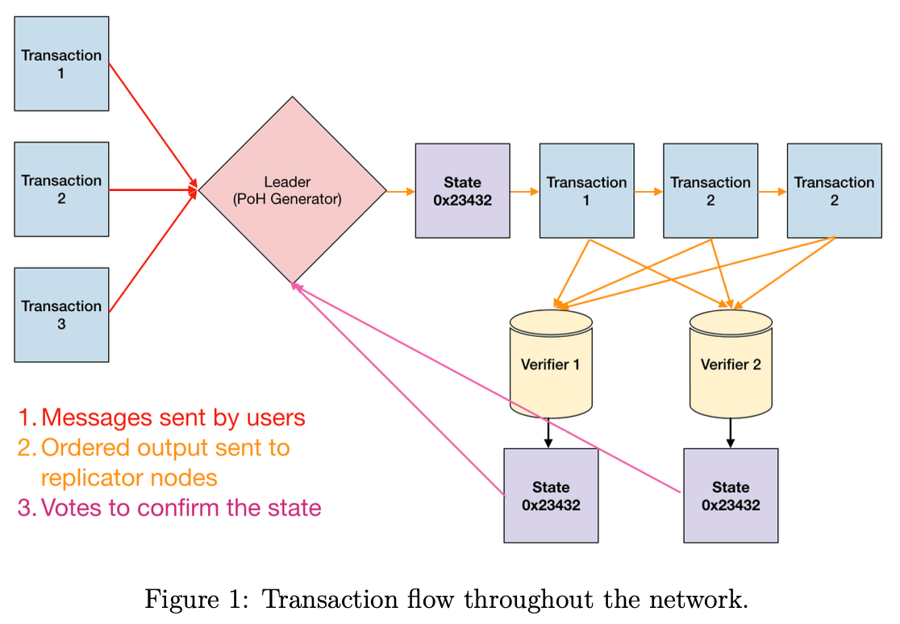

# Solana White Paper Summary

**Original Title:**
Solana: A new architecture for a high performance blockchain v0.8.14

Author:
Anatoly Yakovenko

**I (Robinson) have studied the original Solana White Paper version 0.8.14 (which was published on GitHub on October 18, 2018 in the solana-labs/whitepaper repository) and have taken notes here to come back to and work on later, feel free to have a read...**

## Table of Contents
[Abstract](#abstract)
1. [Introduction](#introduction)
2. [Outline](#outline)
3. [Network Design](#network-design)

## Abstract

This paper proposes a new blockchain architecture based on Proof of History (PoH) - a prroof for verifying order and passage of time between events. PoH is used to encode trustless passage of time into a ledger - an append only data structure (Append only means new data can only be added to the end of the blockchain, existing data can't be modified, deleted or reordered... This ensures immutability as once semething is added, it stays this way permanent). When used alongside a consensus algorithm such as Proof of Work (PoW) or Proof of Stake (PoS), PoH can reduce messaging overhead in a Byzantine Fault Tolerant replicated state machine, resulting in sub-second finality times.  
This paper also proposes two algorithms that leverage the time keeping properties of the PoH ledger - a PoS algorithm that can recover from partitions of any size an efficient streaming Proof of Replication (PoRep). **The combination of PoRep and PoH provides a defense against forgery of the ledger with respect to time (ordering) and storage.** The protocol is analyzed on a 1 gbps network, and this paper shows that throughput up to 710K transactions per second (TPS) is possible with today's hardware.

## 1. Introduction

Blockchain is an implementation of a fault tolerant replicated state machine (a distributed computing model where multiple identical copies of a system process the same sequence of inputs to maintain consistent states across all instances, while being designed to continue operating correctly even if some replicas fail or behave maliciously).  
Current publicly available blockchains do not rely on time, or make a weak assumption about the participant's abilities to keep time. Each node in the network usually relies on their own local clock without knowledge of any other participants clocks in the network. The lack of a trusted source of time means that when a message timestamp is used to accept or reject a message, there is no guarantee that every other participant in the network will make the exact same choice. The PoH presented here is designed to create a ledger with verifiable passage of time, i.e. duration between events and message ordering. It is anticipated that every node in the network will be able to rely on the recorded passage of time in the ledger without trust.

## 2. Outline

Description about how this paper is organized...

## 3. Network Design

As shown in **Figure 1**, at any given time a system node is designated as Leader to generate a Proof of History sequence, providing the network global read consistency and a verifiable passage of time. The Leader sequences user messages and orders them such that they can be efficiently processed by other nodes in the system, **maximizing throughput**. It executes the transactions on the current state that is stored in RAM and publishes the transactions and a signature of the final state to the replications nodes called **Verifiers**. Verifiers execute the same transactions on their copies of the state, and publish their computed signatures of the state as confirmations. The published confirmations serve as votes for the consensus algorithm.

In a non-partitioned state, at any given time, there is one Leader in the network. Each Verifier node has the same hardware capabilities as a Leader and can be elected as a Leader, this is done through PoS based elections.

